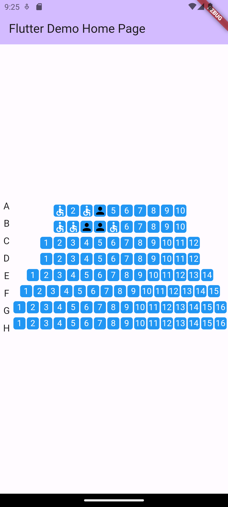

# g_cinema_layout

This library aims to have some common widgets for designing a whole system for buying and selling tickets for a movie theater.

It doesn't have big pretensions, it's just a proof of concept, but if this works, maybe in the future more functionality than just cinema designs will be added.

## Install

Add `g_cinema_layout` as a dependency in pubspec.yaml For help on adding as a dependency, view the [documentation](https://flutter.io/using-packages/).

```yaml
dependencies:  g_cinema_layout: 0.0.1
```

## Usage

### Props

| Property     | Description                                                  |
| ------------ | ------------------------------------------------------------ |
| rowsByLetter | `Map<String,int>` where the letter and the number of seats per letter are indicated. |
| specialSeats | `Map<String,List<int>>` where it's indicated which seats of which row will be special (wheelchair icon). |
| blockSeats   | `Map<String,List<int>>` where it's indicated which seats of which row will be blocked or occupied (non-reactive). |
| width        | `int`, width size of the widget container.                   |
| onTap        | `Function(String, int)`, it's a method that propagates from the `BtnRow` and gets the letter and button number, row and seat basically. |
| maxZoom      | `double`, This value is used to specify the maximum level of zoom that you can apply to the view. |
| color        | `Color`, it's the color of the button, by default it's blue. |
| iconColor    | `Color`, it's the color of the unselected or blocked icon.   |
| toggleIcon   | `IconData`, it's the icon for the blocked or selected seat.  |
| toggleColor  | `Color`, it's the color for the blocked or selected icon.    |

### Sample Code

```dart
TheaterRows(
                rowsByLetter: Map.from({
                  'A': 10,
                  'B': 10,
                  'C': 12,
                  'D': 12,
                  'E': 14,
                  'F': 15,
                  'G': 16,
                  'H': 16,
                }),
                specialSeats: Map.from({
                  'A': [3, 1],
                  'B': [1, 2, 5],
                }),
                blockSeats: Map.from({
                  'A': [4],
                  'B': [3, 4],
                }),
                width: MediaQuery.of(context).size.width,
                onTap: btnOntap,
                maxZoom: 3,
              )
```
